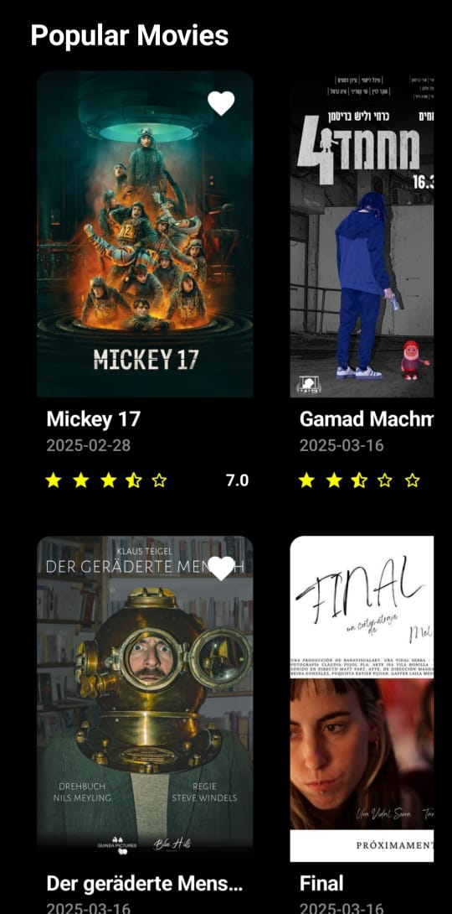

# 🎬 Movie Listing App

This is a movie listing application that displays the best movies of 2024 using **TheMovieDB API**. The app follows the **MVVM architecture** and supports **offline favorites**.

---

## 📌 Features
- Fetches a list of the **best movies of 2024** from TheMovieDB API.
- Displays **movie posters, names, ratings, and release dates** in the movie list.
- Allows users to **add/remove movies from favorites**, with data stored offline.
- Clicking on a movie opens a **detailed page** with additional information:
  - Overview
  - Vote Average
  - Original Language
  - Favorite status (syncs with the main list)

---
## 🖼️ Screenshots

### **Movie Listing Screen**
This screen displays a list of the best movies of 2024 with images, titles, ratings, and release dates.



---

### **Movie Details Screen**
This screen shows detailed information about a selected movie, including its overview, vote average, original language, and favorite status.


## 🏗️ Tech Stack
- **Language**: Kotlin
- **Architecture**: MVVM (Model-View-ViewModel)
- **Networking**: Retrofit + Gson
- **Offline Storage**: Room Database
- **UI**: XML (Jetpack components)
- **Dependency Injection**: Hilt
  
---

--
## 🔧 Installation & Setup

1. Clone the repository:
    ```bash
     git clone https://github.com/fatmahgazy/MovieApp.git
    ```
2. Open the project in **Android Studio**.
3. Sync Gradle and build the project.
4. Run the app on an emulator or a physical device.

---

## 🌟 Contributing
Pull requests are welcome! If you find a bug or have a feature request, feel free to open an issue.
